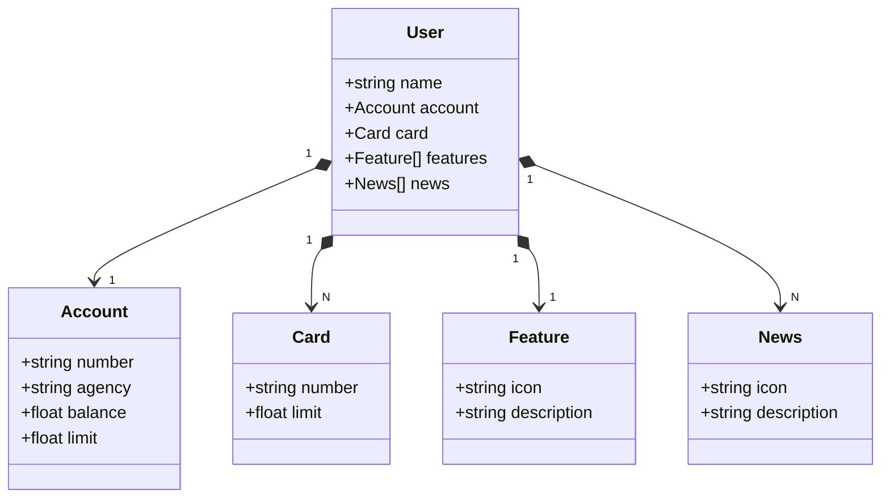

# Santander Dev Week
java RESTful API criada para a Santander Dev Week.

## Diagrama de Classes

```mermaid
classDiagram
    class User {
        +string name
        +Account account
        +Card card
        +Feature[] features
        +News[] news
    }

    class Account {
        +string number
        +string agency
        +float balance
        +float limit
    }

    class Card {
        +string number
        +float limit
    }

    class Feature {
        +string icon
        +string description
    }

    class News {
        +string icon
        +string description
    }

    User "1" *--> "1" Account
    User "1" *--> "N" Card
    User "1" *--> "1" Feature
    User "1" *--> "N" News
```
